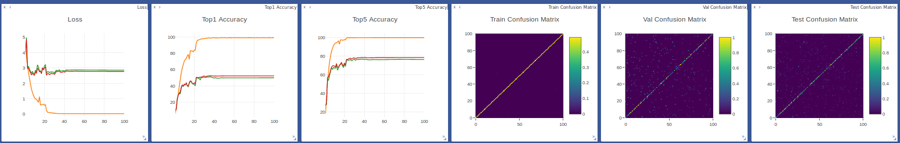
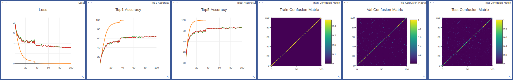
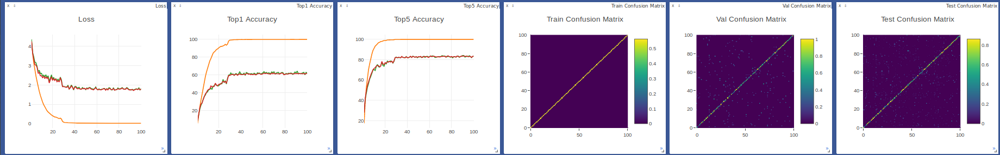
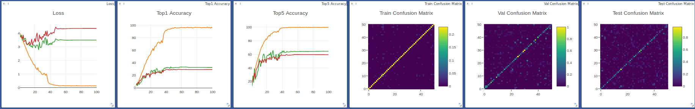
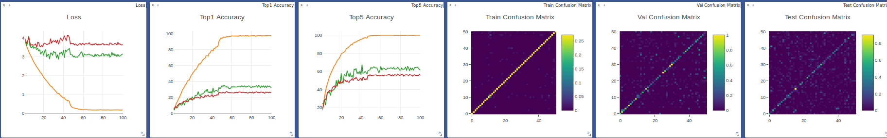

# STTS
A PyTorch implementation of Spatio-Temporal and Temporal-Spatio Convolutional Network based on the paper 
[Spatio-Temporal and Temporal-Spatio Convolutional Network for Activity Recognition]().

## Requirements
- [Anaconda](https://www.anaconda.com/download/)
- [PyTorch](https://pytorch.org)
```
conda install pytorch torchvision -c pytorch
```
- opencv
```
conda install opencv
```
- rarfile
```
pip install rarfile
```
- rar
```
sudo apt install rar
```
- unrar
```
sudo apt install unrar
```
- PyTorchNet
```
pip install git+https://github.com/pytorch/tnt.git@master
```

## Datasets
The datasets are coming from [UCF101](http://crcv.ucf.edu/data/UCF101.php) and 
[HMDB51](http://serre-lab.clps.brown.edu/resource/hmdb-a-large-human-motion-database/).
Download `UCF101` and `HMDB51` datasets with `train/val/test` split files into `data` directory.
We use the `split1` to split files. Run `misc.py` to preprocess these datasets.

## Usage
### Train Model
```
visdom -logging_level WARNING & python train.py --num_epochs 20
optional arguments:
--data_type                   dataset type [default value is 'ucf101'](choices=['ucf101', 'hmdb51'])
--gpu_ids                     selected gpu [default value is '0,1']
--model_type                  model type [default value is 'stts-a'](choices=['stts-a', 'stts', 'r2plus1d', 'c3d'])
--batch_size                  training batch size [default value is 16]
--num_epochs                  training epochs number [default value is 100]
```
Visdom now can be accessed by going to `127.0.0.1:8097` in your browser.

### Inference Video
```
python inference.py --video_name data/ucf101/ApplyLipstick/v_ApplyLipstick_g04_c02.avi
optional arguments:
--data_type                   dataset type [default value is 'ucf101'](choices=['ucf101', 'hmdb51'])
--model_type                  model type [default value is 'stts-a'](choices=['stts-a', 'stts', 'r2plus1d', 'c3d'])
--video_name                  test video name
--model_name                  model epoch name [default value is 'ucf101_stts-a.pth']
```
The inferences will show in a pop up window.

## Benchmarks
Adam optimizer (lr=0.0001) is used with learning rate scheduling. The models are trained with 100 epochs and batch size 
of 16 on two NVIDIA Tesla V100 (32G) GPUs. 

The videos are preprocessed as 32 frames of 128x128, and cropped to 112x112.

Here is the dataset details:
<table>
  <thead>
    <tr>
      <th>Dataset</th>
      <th>UCF101</th>
      <th>HMDB51</th>
    </tr>
  </thead>
  <tbody>
    <tr>
      <td align="center">Num. of Train Videos</td>
      <td align="center">9,537</td>
      <td align="center">3,570</td>
    </tr>
    <tr>
      <td align="center">Num. of Val Videos</td>
      <td align="center">756</td>
      <td align="center">1,666</td>
    </tr>
    <tr>
      <td align="center">Num. of Test Videos</td>
      <td align="center">3,783</td>
      <td align="center">1,530</td>
    </tr>
    <tr>
      <td align="center">Num. of Classes</td>
      <td align="center">101</td>
      <td align="center">51</td>
    </tr>
  </tbody>
</table>

Here is the model parameter, accuracy and training time details:
<table>
  <thead>
    <tr>
      <th>Dataset</th>
      <th>UCF101</th>
      <th>UCF101</th>
      <th>UCF101</th>
      <th>HMDB51</th>
      <th>HMDB51</th>
      <th>HMDB51</th>
    </tr>
  </thead>
  <tbody>
    <tr>
      <td align="center">C3D</td>
      <td align="center">78,409,573</td>
      <td align="center">/</td>
      <td align="center">6.5h</td>
      <td align="center">78,204,723</td>
      <td align="center">/</td>
      <td align="center">/</td>
    </tr>
    <tr>
      <td align="center">R2Plus1D</td>
      <td align="center">33,220,990</td>
      <td align="center">/</td>
      <td align="center">10.8h</td>
      <td align="center">33,195,340</td>
      <td align="center">/</td>
      <td align="center">/</td>
    </tr>
    <tr>
      <td align="center">STTS</td>
      <td align="center">33,208,373</td>
      <td align="center"><b>/</b></td>
      <td align="center">13.8h</td>
      <td align="center">33,182,723</td>
      <td align="center">/</td>
      <td align="center">/</td>
    </tr>
    <tr>
      <td align="center">STTS-A</td>
      <td align="center">37,344,339</td>
      <td align="center">/</td>
      <td align="center">16.9h</td>
      <td align="center">37,318,689</td>
      <td align="center">/</td>
      <td align="center">/</td>
    </tr>
  </tbody>
</table>

## Results
The train/val/test loss, accuracy and confusion matrix are showed on visdom. 
### UCF101
**C3D**

**R2Plus1D**

**STTS**

**STTS-A**


### HMDB51
**C3D**

**R2Plus1D**

**STTS**

**STTS-A**


